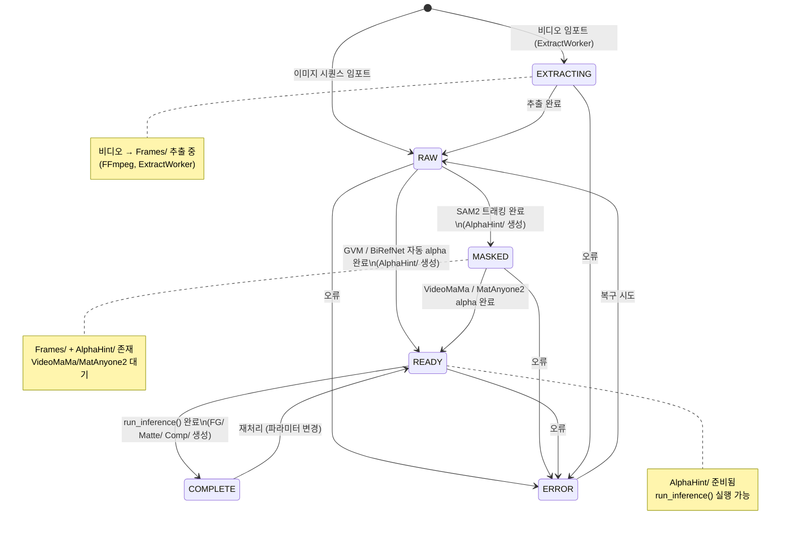
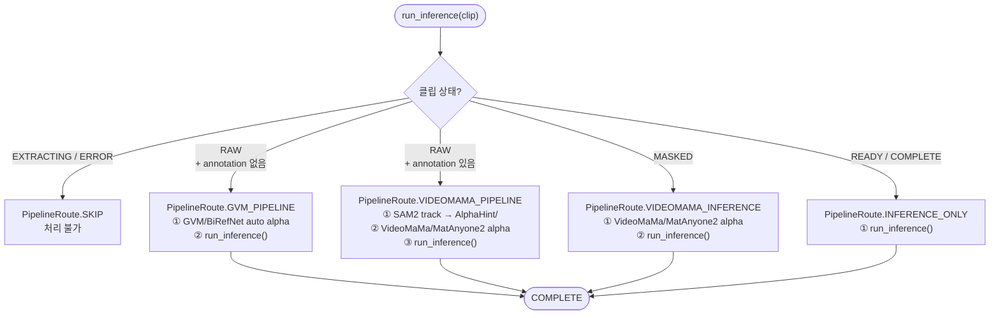
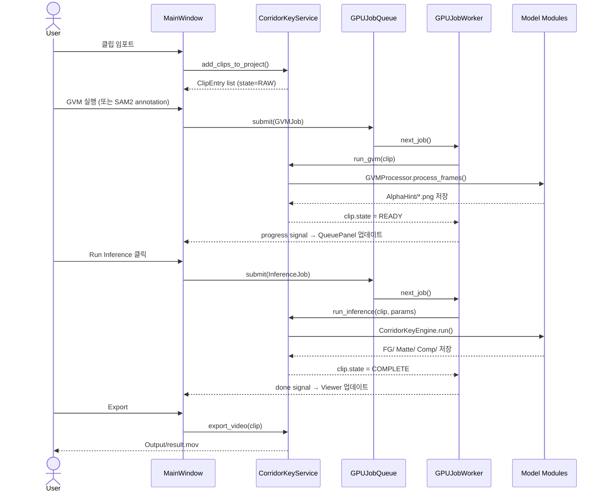

# Clip Lifecycle & Processing Pipelines

클립의 상태 전이, 파이프라인 라우팅, 작업 큐 흐름.

---

## Clip State Machine

---

## Pipeline Routes

`run_inference()` 호출 시 clip 상태에 따라 자동 경로 결정됨 (`backend/clip_state.py`).

---

## End-to-End Processing Flow

---

## Job Types (backend/job_queue.py)

| Job Type | 트리거 | 실행 모델 | 출력 |
|---|---|---|---|
| `INFERENCE` | Run 버튼 | CorridorKeyEngine | FG/ Matte/ Comp/ |
| `GVM_ALPHA` | GVM 버튼 | GVMProcessor | AlphaHint/ |
| `BIREFNET_ALPHA` | BiRefNet 버튼 | BiRefNetProcessor | AlphaHint/ |
| `SAM2_PREVIEW` | Annotation 페인팅 | SAM2Tracker | 미리보기 마스크 (메모리) |
| `SAM2_TRACK` | SAM2 Track 버튼 | SAM2Tracker | AlphaHint/ |
| `VIDEOMAMA_ALPHA` | VideoMaMa 버튼 | VideoInferencePipeline | AlphaHint/ |
| `MATANYONE2_ALPHA` | MatAnyone2 버튼 | MatAnyone2Processor | AlphaHint/ |
| `VIDEO_EXTRACT` | 비디오 임포트 | FFmpeg | Frames/ |
| `VIDEO_STITCH` | Export | FFmpeg | Output/*.mov |
| `PREVIEW_REPROCESS` | 파라미터 변경 | CorridorKeyEngine | 미리보기 (메모리) |
