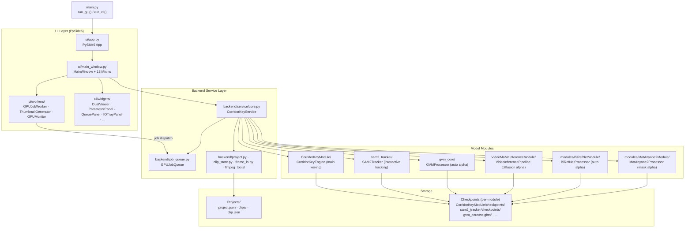
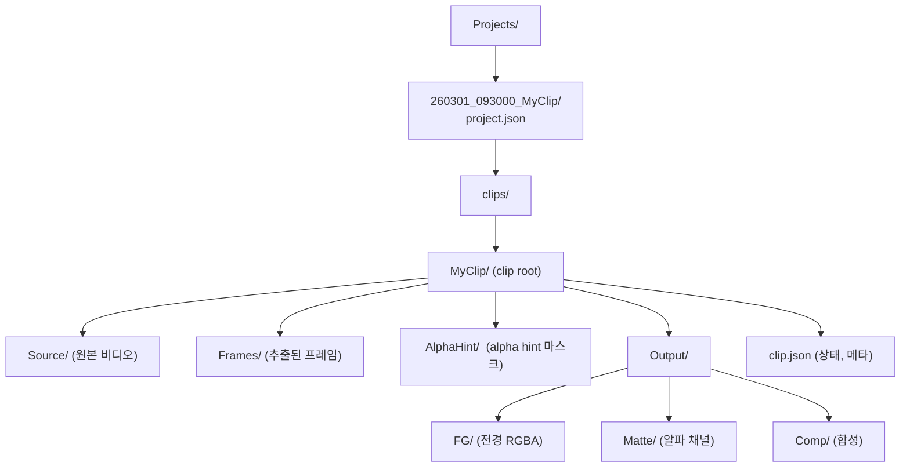

# EZ-CorridorKey Architecture Overview

전체 레이어 구조와 데이터 흐름의 큰 그림.

---

## System Layers

---

## Project Folder Structure (Runtime)

---

## Model Checkpoint Locations

| 모델 | 위치 | 다운로드 방식 |
|---|---|---|
| CorridorKey | `CorridorKeyModule/checkpoints/*.pth` | HuggingFace single file |
| SAM2 | `sam2_tracker/checkpoints/models--facebook--...` | HuggingFace hub cache |
| GVM | `gvm_core/weights/` | HuggingFace snapshot |
| VideoMaMa | `VideoMaMaInferenceModule/checkpoints/` | HuggingFace snapshot |
| BiRefNet | `modules/BiRefNetModule/checkpoints/<variant>/` | HuggingFace snapshot |
| MatAnyone2 | `modules/MatAnyone2Module/checkpoints/matanyone2.pth` | GitHub Releases |
| CorridorKey MLX | `CorridorKeyModule/checkpoints/corridorkey_mlx.safetensors` | GitHub Releases |

> **SAM2 SSOT**: `sam2_tracker/paths.py` — `get_sam2_cache_dir()` 함수로 경로 결정. frozen 빌드는 `get_data_dir()` 하위로 변경됨.
