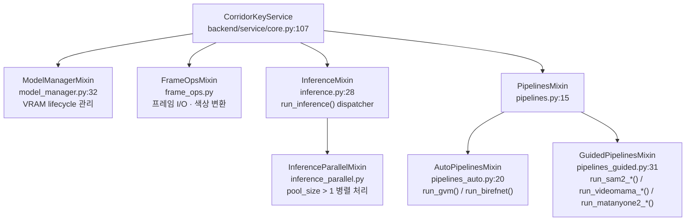
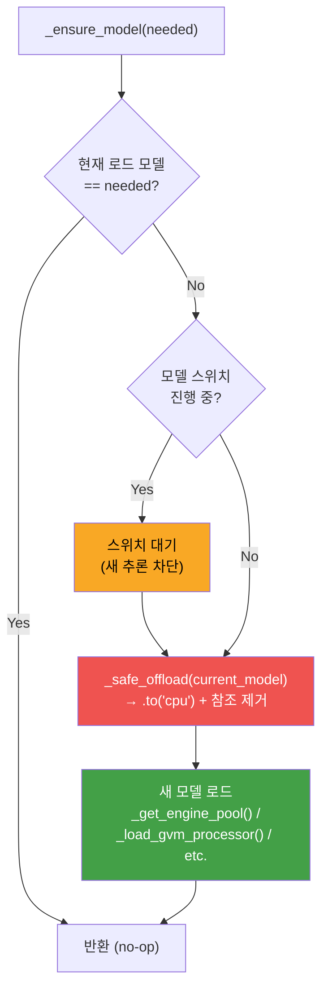
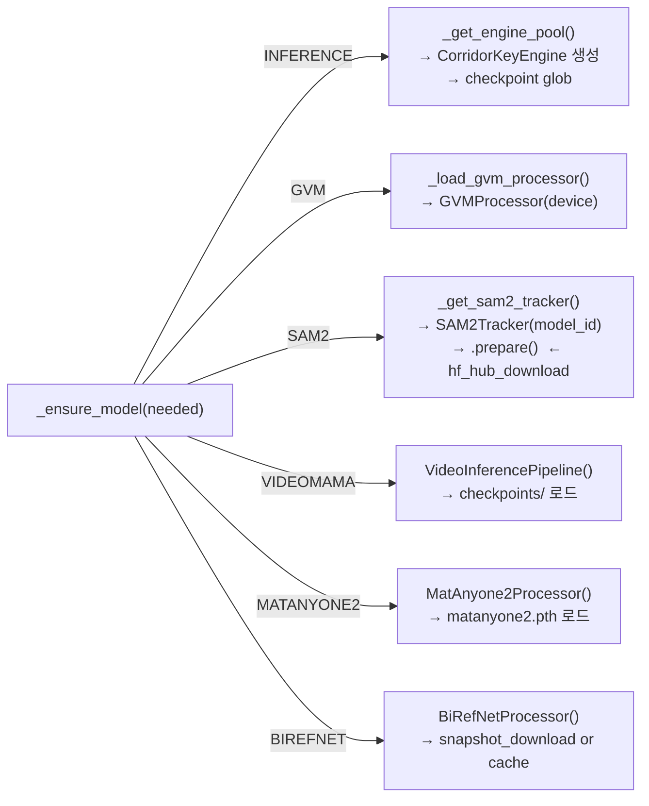

# Backend Service Layer

`CorridorKeyService`의 내부 구조, Mixin 상속, VRAM 관리 정책.

---

## CorridorKeyService 구성



---

## ModelManagerMixin: VRAM 관리 정책

한 번에 **Heavy Model 1개**만 VRAM에 로드. 스위치 시 이전 모델을 CPU로 offload.



### _ActiveModel Enum (model_manager.py:21)

| 값 | 모델 |
|---|---|
| `NONE` | 아무 모델도 없음 |
| `INFERENCE` | CorridorKeyEngine |
| `GVM` | GVMProcessor |
| `SAM2` | SAM2Tracker |
| `VIDEOMAMA` | VideoInferencePipeline |
| `MATANYONE2` | MatAnyone2Processor |
| `BIREFNET` | BiRefNetProcessor |

---

## InferenceMixin: run_inference 흐름

```mermaid
flowchart TD
    RI["run_inference(clip, params, job, ...)"]

    RI --> Pool{pool_size > 1?}
    Pool -->|Yes| Par["_run_inference_parallel()\ninference_parallel.py\n여러 CorridorKeyEngine 동시 처리"]
    Pool -->|No| Seq["_run_inference_sequential()\n단일 엔진 순차 처리"]

    Par --> Frame["각 프레임:\n1. read_frame(Frames/)\n2. read_alpha(AlphaHint/)\n3. engine.run(input, alpha)\n4. write(FG/ Matte/ Comp/)"]
    Seq --> Frame

    Frame --> Chk{cancel_check()}
    Chk -->|"cancelled"| Cancel["JobCancelledError"]
    Chk -->|"ok"| Progress["on_progress(current, total)"]
    Progress --> Frame
```

---

## CorridorKeyService 주요 속성 (core.py:129)

| 속성 | 타입 | 역할 |
|---|---|---|
| `_engine_pool` | `list[CorridorKeyEngine]` | 추론 엔진 풀 (pool_size 개) |
| `_pool_size` | `int` | 병렬 엔진 수 (기본 1) |
| `_model_resolution` | `int` | 추론 해상도 (1024/2048) |
| `_device` | `str` | "cuda" / "cpu" / "mps" |
| `_active_model` | `_ActiveModel` | 현재 VRAM 로드 모델 |
| `_gpu_lock` | `threading.Lock` | GPU 상호배제 |
| `_job_queue` | `GPUJobQueue` | 작업 큐 (lazy init) |
| `_sam2_tracker` | `SAM2Tracker \| None` | SAM2 인스턴스 |
| `_gvm_processor` | `GVMProcessor \| None` | GVM 인스턴스 |
| `_birefnet_processor` | `BiRefNetProcessor \| None` | BiRefNet 인스턴스 |
| `_videomama_pipeline` | `VideoInferencePipeline \| None` | VideoMaMa 인스턴스 |
| `_matanyone2_processor` | `MatAnyone2Processor \| None` | MatAnyone2 인스턴스 |

---

## 모델별 로딩 경로 (model_manager.py)


