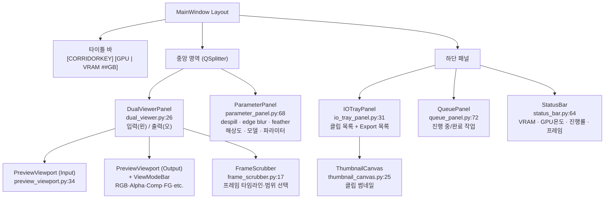
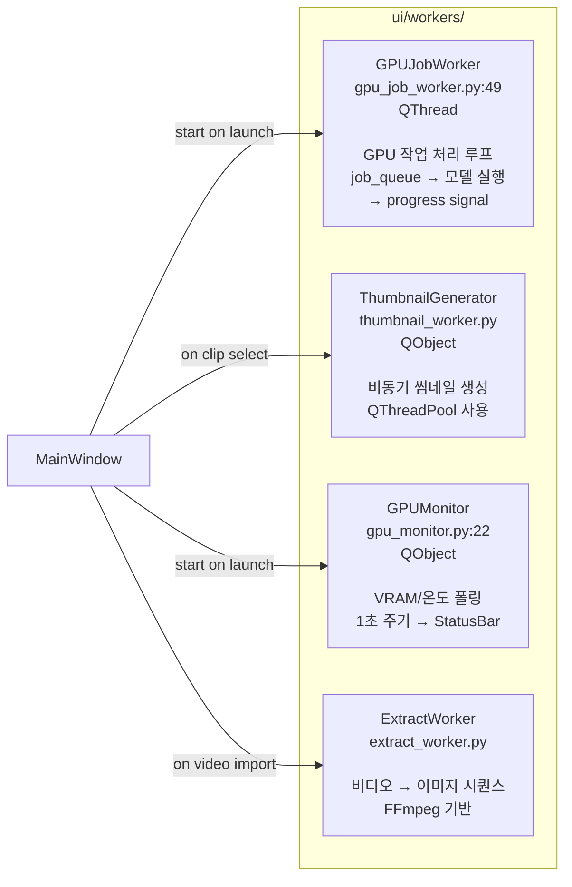
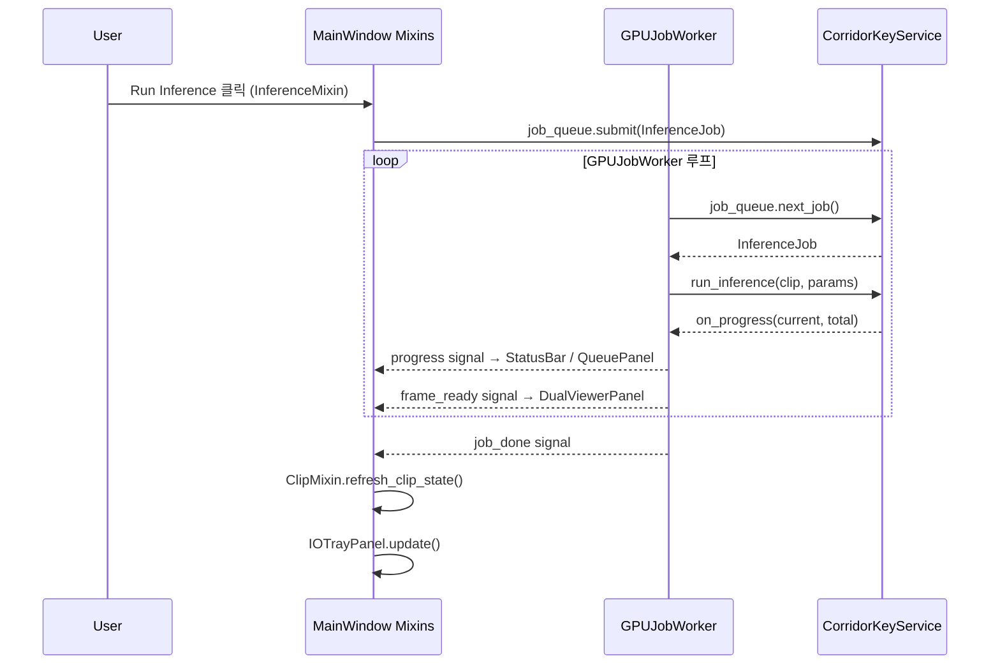
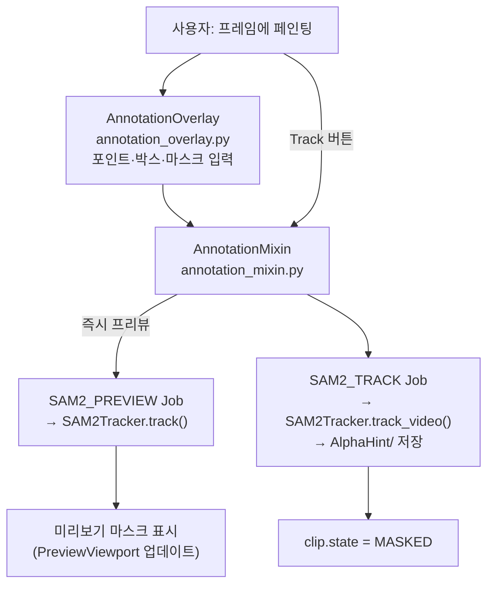
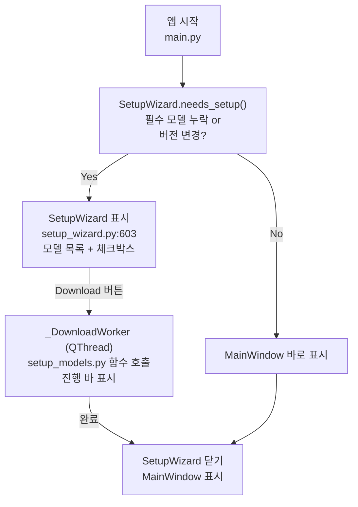

# UI Layer Architecture

MainWindow 구성, Mixin 역할 분담, Widget/Worker 구조.

---

## MainWindow 상속 구조

```mermaid
graph TD
    MW["MainWindow<br/>ui/main_window.py:242<br/>QMainWindow"]

    MW --> MenuM["MenuMixin<br/>menu_mixin.py<br/>메뉴 바 (File/Edit/View/Help)"]
    MW --> ShortM["ShortcutsMixin<br/>shortcuts_mixin.py<br/>키보드 단축키"]
    MW --> ClipM["ClipMixin<br/>clip_mixin.py<br/>클립 선택·추가·제거·상태"]
    MW --> ImportM["ImportMixin<br/>import_mixin.py<br/>프로젝트/클립 임포트"]
    MW --> AlphaM["AlphaImportMixin<br/>alpha_import_mixin.py<br/>Alpha hint 임포트"]
    MW --> AnnoM["AnnotationMixin<br/>annotation_mixin.py<br/>SAM2 마스크 페인팅"]
    MW --> InfM["InferenceMixin<br/>inference_mixin.py<br/>추론 파라미터·live preview"]
    MW --> RunM["ModelRunMixin<br/>model_run_mixin.py<br/>GVM·SAM2·VideoMaMa 실행 UI"]
    MW --> WorkM["WorkerMixin<br/>worker_mixin.py<br/>백그라운드 워커 생명주기"]
    MW --> CancelM["CancelMixin<br/>cancel_mixin.py<br/>작업 취소"]
    MW --> ExpM["ExportMixin<br/>export_mixin.py<br/>결과 export"]
    MW --> SessM["SessionMixin<br/>session_mixin.py<br/>세션 로드·저장"]
    MW --> SetM["SettingsMixin<br/>settings_mixin.py<br/>Preferences 열기·적용"]
```

---

## MainWindow Layout & Widgets

---

## Background Workers

---

## Signal Flow (UI ↔ Backend)

---

## Annotation Workflow (SAM2)

---

## SetupWizard Flow (첫 실행)

