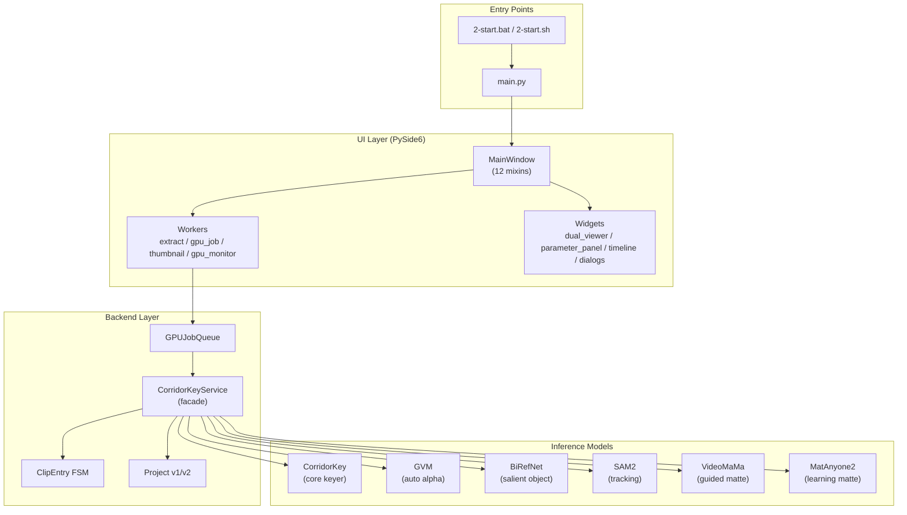
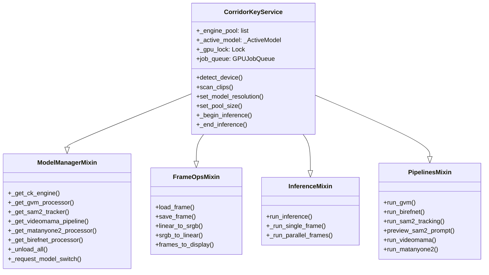
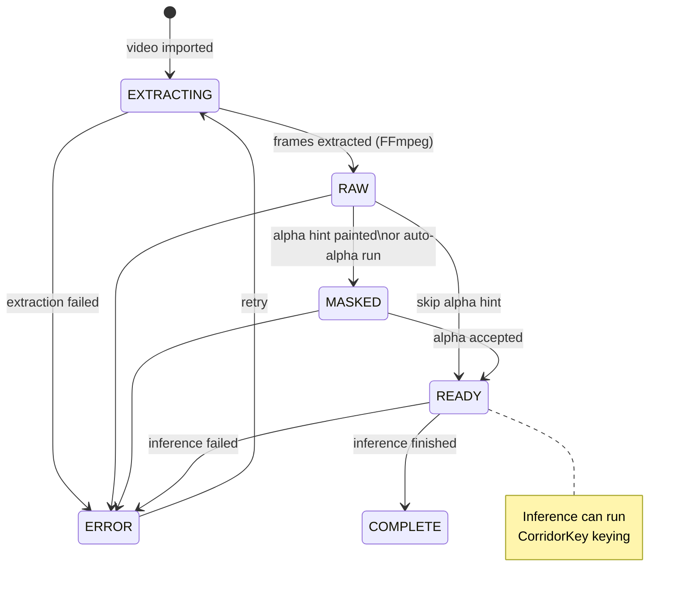
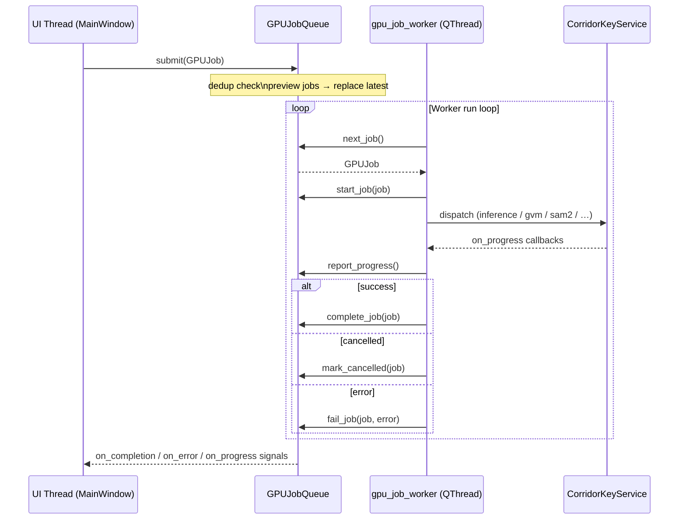
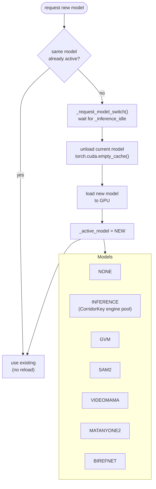
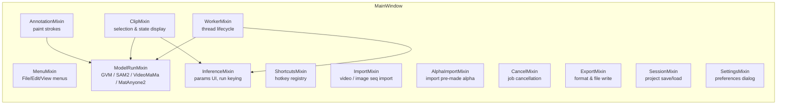
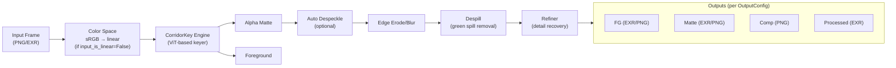
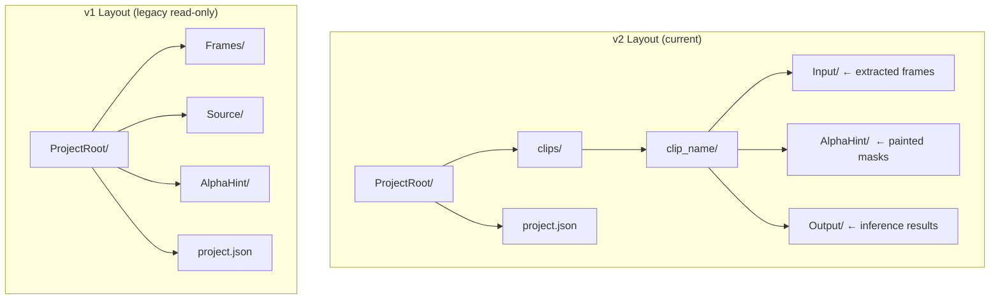
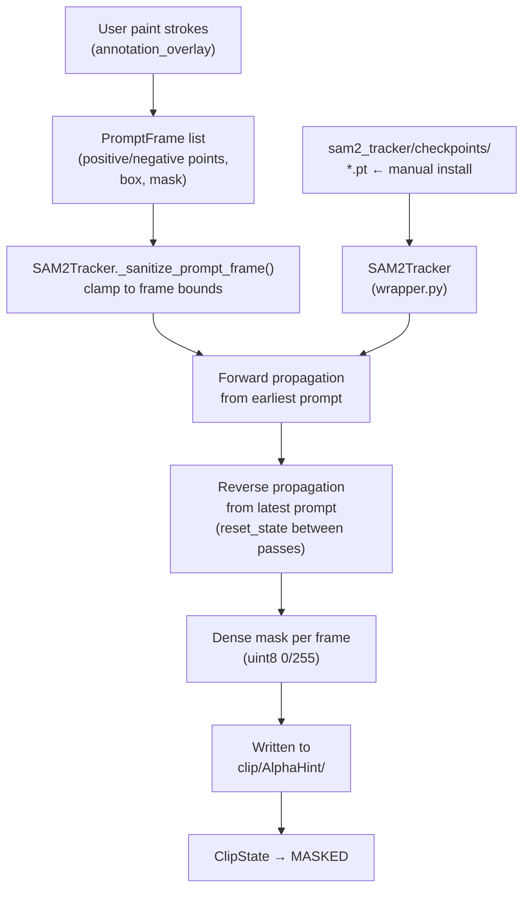

# EZ-CorridorKey Architecture

## 1. System Overview

---

## 2. CorridorKeyService — Mixin Composition

---

## 3. Clip State Machine

---

## 4. GPU Job Queue Flow

---

## 5. Model Residency & VRAM Policy

---

## 6. UI MainWindow Mixin Structure

---

## 7. Frame Processing Pipeline (CorridorKey Inference)

---

## 8. Project On-Disk Layout

---

## 9. SAM2 Tracking Data Flow

